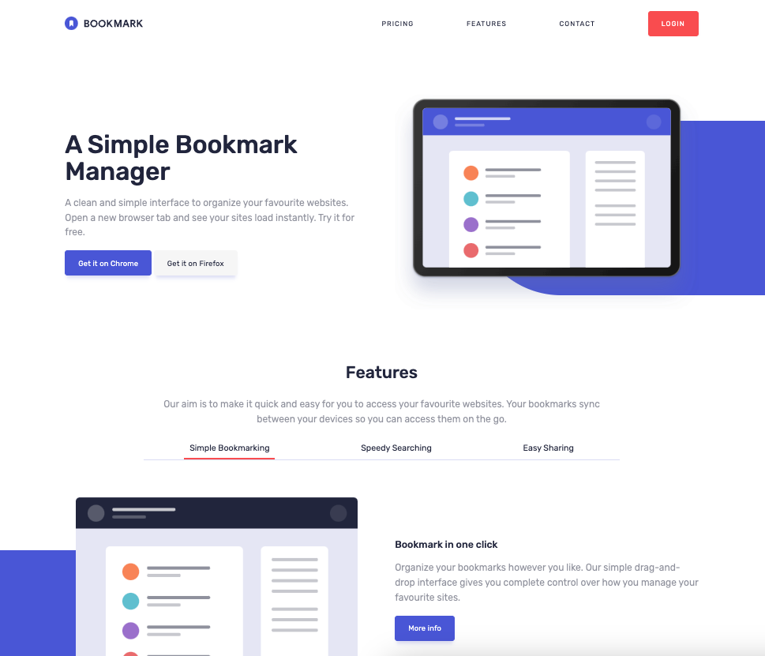

# Frontend Mentor - Bookmark landing page solution

This is a solution to the [Bookmark landing page challenge on Frontend Mentor](https://www.frontendmentor.io/challenges/bookmark-landing-page-5d0b588a9edda32581d29158). Frontend Mentor challenges help you improve your coding skills by building realistic projects.

## Table of contents

- [Overview](#overview)
  - [The challenge](#the-challenge)
  - [Screenshot](#screenshot)
  - [Links](#links)
- [My process](#my-process)
  - [Built with](#built-with)
  - [What I learned](#what-i-learned)
  - [Continued development](#continued-development)
  - [Useful resources](#useful-resources)
- [Author](#author)

## Overview

### The challenge

Users should be able to:

- View the optimal layout for the site depending on their device's screen size
- See hover states for all interactive elements on the page
- Receive an error message when the newsletter form is submitted if:
  - The email address is not formatted correctly

### Screenshot



### Links

- [Live Site URL](https://your-live-site-url.com)

## My process

### Built with

- Semantic HTML5 markup
- CSS custom properties
- SASS (Mixins for responsive layouts)
- Flexbox
- JavaScript

### What I learned

I learned a lot about manipulating SVGs. I was really excited when I figured out how to manipulate the shape and color of the SVG chevron used in the FAQ section. Previously, I have only worked with display: none and display:block to show different images depending on the screen size. I like how this keeps the HTML code clean, semantic, and meaningful (instead of adding unnecessary extra divs, or other decorative content)

```html
<svg xmlns="http://www.w3.org/2000/svg" width="18" height="12">
  <path
    class="my-svg"
    fill="none"
    stroke="#5267DF"
    stroke-width="3"
    d="M1 1l8 8 8-8"
  />
</svg>
```

```js
if (accordionContent.style.display === "block") {
  accordionContent.style.display = "none";
  accordionSVG.setAttribute("stroke", "#5267DF");
  accordionSVG.setAttribute("d", "M 1 1 l 8 8 8-8");
} else {
  accordionContent.style.display = "block";
  accordionSVG.setAttribute("stroke", "#fa5959");
  accordionSVG.setAttribute("d", "M 1 9 l 8 -8 l 8 8");
}
```

### Continued development

I wanted to practice using SASS to organize the CSS layout, and focus on building components and whole page layout/typography, that could easily be manipulated. I found that in the beginning, I was able to keep it very structured, but it got a little messy as I went further through the design and didn't account for different variations of elements. Going forward, I want to work on my full-page planning/layout first to address some of the roadblocks I encountered with building section by section.

### Useful resources

- [ChatGPT](https://chat.openai.com/) - I found it very helpful to ask ChatGPT to help me build starter code for different sections, especially as it related to functionality. Having a starting point made it a lot easier to implement. I will continue to use this as a tool going forward. While it can be scary to think that this could essentially build this project for me if you gave it specific enough prompts, I think leveraging this technology as a tool to be more productive and spend less time on the little things. It still requires knowledge of fundamentals to decipher what it is attempting, and adjusting it to fit your specific needs.

## Author

- Frontend Mentor - [@krosinsky](https://www.frontendmentor.io/profile/krosinsky)
